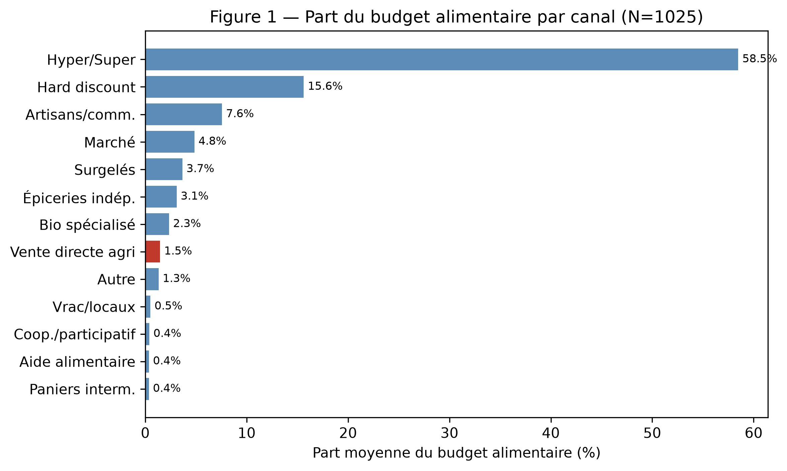
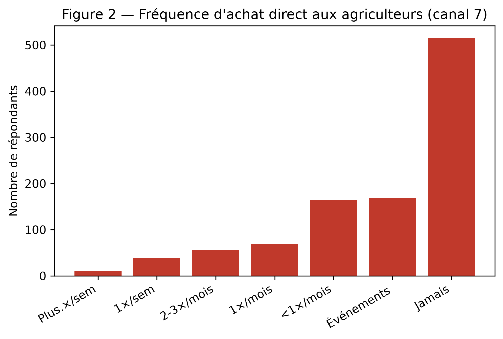
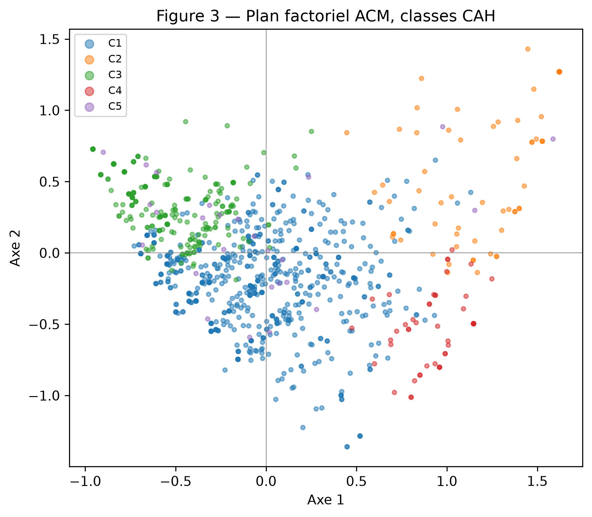
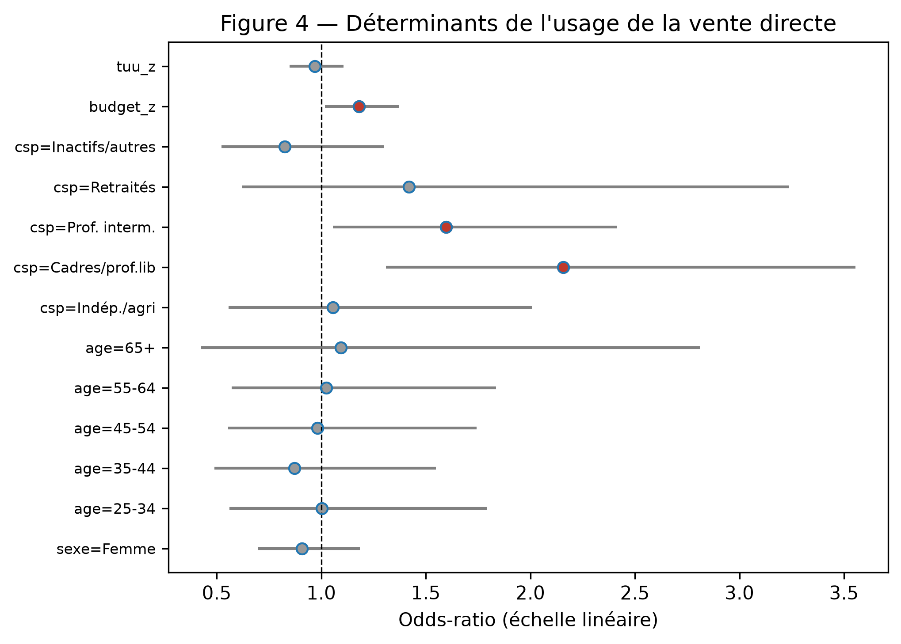
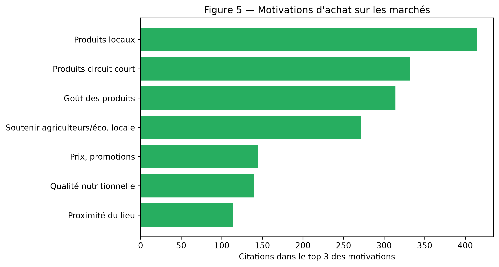

# Résumé

La vente directe de produits alimentaires — achat au producteur via les marchés, les magasins de producteurs, les AMAP, la vente à la ferme ou les paniers en précommande — est souvent étudiée du point de vue de ses formes d'organisation ou des motivations militantes de ses adeptes. Cet article adopte une focale différente, **centrée sur le ménage** : il analyse la place qu'occupe la vente directe dans le **portefeuille de canaux** d'approvisionnement, c'est-à-dire dans la combinaison de lieux et de modalités d'achat que chaque foyer mobilise. À partir d'une enquête par questionnaire auprès d'un échantillon représentatif national de **1 025 ménages français** responsables de leurs achats alimentaires, nous mesurons la fréquentation et la part de budget de treize canaux, puis nous construisons une typologie des stratégies d'approvisionnement par analyse des correspondances multiples et classification ascendante hiérarchique. Trois résultats principaux émergent. Premièrement, la vente directe présente un **paradoxe d'ampleur** : elle touche **65 % des ménages** mais ne représente qu'une part marginale du budget (environ 1,5 % pour l'achat direct aux agriculteurs), confirmant son statut de **canal de complémentarité ciblée** plutôt que de substitution. Deuxièmement, cinq stratégies d'approvisionnement se distinguent, depuis les « captifs de la grande distribution » jusqu'aux « omnivores engagés », en passant par un petit groupe original de ménages à budget modeste qui se tiennent **hors de l'hypermarché**. Troisièmement, le recours à la vente directe est **faiblement déterminé** par le profil sociodémographique (pseudo-R² = 0,022) : il traverse les catégories sociales, avec une sur-représentation seulement modérée des cadres et des budgets élevés. Ces résultats invitent à penser la vente directe non comme une pratique de niche socialement clivante, mais comme un **complément diffus** intégré à des stratégies d'approvisionnement plurielles.

**Mots-clés** : vente directe ; circuits courts ; approvisionnement alimentaire ; stratégies de canal ; comportement du consommateur ; France.

> *Note d'intégrité (pré-Stade 2.5).* Tous les résultats chiffrés de cet article proviennent de l'analyse réelle de l'enquête 24407 (`code/`, `data/processed/`). Les références bibliographiques citées sont des candidats sélectionnés au Stade 1 et **doivent encore être vérifiées une à une** (existence, exactitude) au Stade 2.5 ; elles sont signalées le cas échéant.

---

# 1. Introduction

L'achat de produits alimentaires en vente directe — sans intermédiaire ou avec un seul intermédiaire entre le producteur et le consommateur — connaît en France une visibilité croissante depuis le début des années 2000. Marchés de plein vent, magasins de producteurs, associations pour le maintien d'une agriculture paysanne (AMAP), vente à la ferme et, plus récemment, plateformes de précommande en ligne (de type *La Ruche qui dit Oui*) composent un paysage de circuits courts dont la portée symbolique excède largement le poids économique [@chiffoleau2019; @praly2014]. Ces dispositifs sont régulièrement présentés comme des leviers de relocalisation alimentaire, de soutien au revenu agricole et de reconnexion entre mangeurs et producteurs.

La recherche francophone a abondamment documenté deux faces de ce phénomène. D'un côté, les **formes d'organisation** de l'offre : la diversité des dispositifs, leurs modèles économiques, leurs trajectoires d'institutionnalisation [@marechal2008; @praly2014]. De l'autre, les **motivations** des consommateurs : quête de qualité et de fraîcheur, confiance dans le producteur, soutien à l'économie locale, sens éthique et environnemental [@dubuisson2011; @lamine2008]. Ces deux littératures, précieuses, partagent toutefois une limite : elles tendent à isoler la vente directe du reste des pratiques d'achat, comme si elle constituait un univers à part, porté par une population spécifique et animé de logiques propres.

Or, du point de vue du ménage, la vente directe n'est presque jamais un **canal exclusif**. Elle s'insère dans une combinaison de lieux et de modalités d'achat — l'hypermarché du samedi, le hard discount d'appoint, le marché du dimanche, l'artisan de quartier, le drive en ligne — que le foyer ajuste selon les produits, les saisons, le temps disponible et le budget. Cette combinaison, que la littérature en distribution nomme **portefeuille de canaux** ou *channel mix* [@volle2012], constitue précisément l'angle mort des travaux sur les circuits courts. Comprendre la place de la vente directe suppose alors de ne plus la regarder seule, mais **dans l'architecture des choix d'approvisionnement** du ménage.

Cet article propose ce déplacement de focale. Il pose la question suivante :

> **Quelle place les achats en vente directe occupent-ils dans les stratégies d'approvisionnement alimentaire des ménages français, et selon quelles logiques se combinent-ils avec les autres canaux de distribution ?**

Quatre sous-questions précisent cette interrogation : (1) quels canaux les ménages combinent-ils, et à quelle fréquence ? (2) quelle part du budget alimentaire la vente directe capte-t-elle ? (3) peut-on identifier des **types** de stratégies d'approvisionnement, et à quels profils correspondent-ils ? (4) le recours à la vente directe est-il socialement déterminé ?

Pour y répondre, nous mobilisons une enquête par questionnaire auprès d'un échantillon représentatif national de 1 025 ménages français. La contribution de l'article est double. Sur le plan **empirique**, il fournit une mesure actualisée, sur données représentatives, de la diffusion et du poids budgétaire de treize canaux d'approvisionnement, et propose une typologie inédite des stratégies de combinaison. Sur le plan **conceptuel**, il importe le cadre du portefeuille de canaux dans l'étude des circuits courts, montrant que la vente directe se comprend mieux comme un **complément diffus** que comme une pratique de niche.

# 2. Cadre conceptuel

## 2.1 Les circuits courts et la vente directe : définitions

En France, la définition administrative des circuits courts retient la présence d'**au plus un intermédiaire** entre le producteur et le consommateur [@maa2009]. La vente directe en constitue le sous-ensemble le plus strict — l'achat sans aucun intermédiaire — et recouvre une pluralité de dispositifs : vente à la ferme, marchés où le producteur vend lui-même, magasins de producteurs, AMAP, paniers en précommande. Cette pluralité de formes partage une caractéristique commune : la **relation directe** au producteur, porteuse d'un supplément de sens et d'information sur le produit [@dubuisson2011].

Dans cet article, nous opérationnalisons la vente directe de façon à capter cette relation directe **quel que soit le lieu** où elle s'exerce. Concrètement, est considéré comme pratiquant la vente directe tout ménage qui déclare soit acheter directement aux agriculteurs en dehors des marchés (AMAP, magasin de producteurs, ferme, paniers), soit acheter sur les marchés **directement auprès d'un producteur** (et non d'un revendeur). Cette double porte — détaillée en section 3 — évite de réduire la vente directe à ses formes les plus institutionnalisées et reconnaît l'importance des marchés comme premier lieu de contact direct avec les agriculteurs.

## 2.2 Du canal isolé au portefeuille de canaux

La littérature en marketing de la distribution a montré de longue date que les consommateurs ne sont pas fidèles à un format unique mais **fréquentent simultanément plusieurs enseignes et formats** (*cross-shopping*), répartissant leurs achats selon une logique de complémentarité [@volle2012; @filserplichon2004]. Le ménage gère ainsi un **portefeuille de canaux**, c'est-à-dire un ensemble de lieux d'achat mobilisés pour des fonctions différentes : l'hypermarché pour le gros des courses et les prix, l'artisan pour la qualité de certains produits, le marché pour le frais et le plaisir, etc.

Appliqué aux circuits courts, ce cadre suggère que la vente directe n'est pas en concurrence frontale avec la grande distribution, mais qu'elle **occupe une fonction spécifique** dans le portefeuille — typiquement, l'approvisionnement de certaines catégories de produits (légumes, œufs, fromages, viande) valorisées pour leur fraîcheur ou leur origine. La question n'est alors plus « pourquoi acheter en vente directe ? » mais « **quelle part et quelle fonction** la vente directe occupe-t-elle dans un portefeuille plus large ? ».

## 2.3 Hypothèses

De ce cadre découlent deux hypothèses, que l'analyse empirique met à l'épreuve.

- **H1 — Complémentarité, non substitution.** La vente directe occupe rarement la place de canal principal ; elle s'inscrit dans des stratégies de complémentarité ciblée, avec une diffusion potentiellement large mais une part de budget faible.

- **H2 — Transversalité sociale.** Parce qu'elle remplit une fonction d'appoint accessible par de multiples lieux (dont les marchés), la pratique de la vente directe est **faiblement déterminée** par le profil sociodémographique : elle traverse les catégories plutôt qu'elle ne distingue un groupe social.

# 3. Méthode

## 3.1 Données et échantillon

L'étude repose sur une enquête par questionnaire (référence 24407) administrée à un **échantillon représentatif national de 1 025 ménages français**, construit par la méthode des quotas (sexe, âge, catégorie socioprofessionnelle, région et taille d'agglomération). Seuls les répondants déclarant être responsables, au moins partiellement, des achats alimentaires de leur foyer ont été retenus (filtre de qualification). L'échantillon compte 52,6 % de femmes ; la structure par âge est équilibrée, avec une part importante de 65 ans et plus (26,0 %), conforme à la démographie française ; les employés et ouvriers (30,0 %) et les retraités (28,1 %) constituent les deux principales catégories socioprofessionnelles. Le budget alimentaire mensuel médian déclaré du foyer s'établit à 400 € (moyenne 436 €). Un sur-échantillon de 75 répondants, fourni séparément, a été exclu afin de préserver la représentativité nationale.

La qualité des données est élevée : les variables clés (sexe, âge, CSP, budget, fréquentation des canaux) ne présentent aucune valeur manquante, et les parts de budget déclarées par canal somment exactement à 100 % pour l'ensemble des répondants, ce qui atteste de la cohérence du protocole de recueil.

## 3.2 Variables

**Fréquentation des canaux.** Pour chacun des treize canaux ou modalités d'achat (tableau 1), le répondant a indiqué sa fréquence d'achat sur une échelle ordinale en sept positions, de « plusieurs fois par semaine » à « jamais ». Nous en dérivons deux indicateurs : la **pénétration** (le ménage fréquente le canal, c'est-à-dire ne répond pas « jamais ») et l'**usage régulier** (au moins une fois par mois).

**Part de budget.** Pour chaque canal fréquenté, le répondant a estimé la part (en %) de son budget alimentaire mensuel qui y est consacrée.

**Vente directe.** Conformément à la section 2.1, un ménage est codé comme pratiquant la vente directe s'il satisfait au moins l'une des deux conditions suivantes : (a) il achète directement aux agriculteurs en dehors des marchés (canal 7, fréquence différente de « jamais ») ; ou (b) il déclare acheter sur les marchés des produits **vendus directement par l'agriculteur**, et en avoir acheté au cours du mois précédant l'enquête. Cette définition combine donc un canal dédié et une pratique transversale aux marchés.

**Variables sociodémographiques.** Sexe, âge (six tranches), catégorie socioprofessionnelle (six postes recodés), budget alimentaire mensuel, et indicateurs géographiques (région, taille d'unité urbaine).

## 3.3 Analyses

Le plan d'analyse comprend six volets. (A1) Une **description du portefeuille** : pénétration, usage régulier et part de budget de chaque canal. (A2) Un **focus sur la vente directe** : décomposition de la pratique selon ses deux portes et distribution des fréquences. (A3) Une **typologie des stratégies d'approvisionnement**, construite par **analyse des correspondances multiples (ACM)** sur la fréquence (recodée en trois niveaux : régulier, occasionnel, jamais) des onze canaux de consommation courante, suivie d'une **classification ascendante hiérarchique (CAH)** selon la méthode de Ward sur les cinq premiers axes factoriels. Le nombre de classes a été arrêté à cinq sur la base du coefficient de silhouette et de l'interprétabilité des profils. (A4) Une **caractérisation sociodémographique** des classes (tris croisés, tests du χ²). (A5) Une **régression logistique** modélisant la probabilité de pratiquer la vente directe en fonction des variables sociodémographiques. (A6) Une analyse des **motivations** d'achat sur les marchés (questions de classement). L'ensemble des traitements a été réalisé sous Python (`pandas`, `scikit-learn`, `statsmodels`, `prince`) et est intégralement reproductible à partir des scripts versionnés.

# 4. Résultats

## 4.1 Le portefeuille de canaux des ménages

Les ménages français mobilisent en moyenne **6,8 canaux** d'approvisionnement différents. Le tableau 1 et la figure 1 en révèlent la hiérarchie. L'**hypermarché-supermarché** domine sans partage : il est fréquenté par 99,1 % des ménages, dont 97,5 % au moins une fois par mois, et capte à lui seul **58,5 % du budget** alimentaire moyen. Viennent ensuite, par leur poids budgétaire, le **hard discount** (15,6 % du budget), les **artisans et commerçants spécialisés** (boucher, boulanger, primeur : 7,6 %) et le **marché** (4,8 %). Les canaux de circuits courts proprement dits — vente directe aux agriculteurs (1,5 %), paniers via intermédiaire (0,4 %) — ne pèsent qu'à la marge.

**Tableau 1.** Pénétration, usage régulier et part de budget des treize canaux (N = 1 025).

| # | Canal | Pénétration | Réguliers | Part budget |
|---|-------|-------------|-----------|-------------|
| 1 | Hyper/super/supérette (+ drive) | 99,1 % | 97,5 % | 58,5 % |
| 2 | Hard discount | 86,5 % | 64,2 % | 15,6 % |
| 9 | Artisans/commerçants spécialisés | 87,1 % | 61,9 % | 7,6 % |
| 6 | Marché | 78,8 % | 41,4 % | 4,8 % |
| 4 | Magasins de surgelés | 74,3 % | 36,0 % | 3,7 % |
| 3 | Épiceries indépendantes | 68,6 % | 35,2 % | 3,1 % |
| 5 | Magasins Bio spécialisés | 57,4 % | 24,2 % | 2,3 % |
| 7 | **Vente directe aux agriculteurs** | **49,7 %** | **17,3 %** | **1,5 %** |
| 11 | Vrac / produits locaux | 21,5 % | 8,7 % | 0,5 % |
| 8 | Paniers via intermédiaire | 15,7 % | 5,8 % | 0,4 % |
| 10 | Coopératives / participatif | 22,9 % | 7,0 % | 0,4 % |
| 12 | Aide alimentaire | 12,3 % | 5,3 % | 0,4 % |
| 13 | Autre | 8,9 % | 6,3 % | 1,3 % |

**Figure 1.** Part moyenne du budget alimentaire par canal. La vente directe (en rouge) demeure marginale en budget malgré une diffusion large.

Ce premier tableau dessine une structure en **noyau et périphérie** : un noyau dominé par la grande distribution et le discount, qui concentre près des trois quarts du budget, et une périphérie de canaux spécialisés — dont la vente directe — fréquentés par beaucoup mais pour de faibles montants.

## 4.2 La place de la vente directe : un paradoxe d'ampleur

En appliquant notre définition à double porte, **65,0 % des ménages** (666 sur 1 025) pratiquent une forme de vente directe (tableau 2). Cette proportion, élevée, masque toutefois une réalité contrastée. Prise canal par canal, l'achat direct aux agriculteurs (canal 7) concerne 49,7 % des ménages, mais seulement 17,3 % de façon régulière (au moins mensuelle ; figure 2). L'apport de la seconde porte — l'achat direct au producteur sur les marchés — est substantiel : elle ajoute **157 ménages** qui pratiquent la vente directe sur les marchés sans recourir au canal dédié, soit un quart de la population concernée.

**Tableau 2.** Décomposition de la pratique de vente directe.

| Composante | n | % échantillon |
|------------|---|---------------|
| Achat direct aux agriculteurs (canal 7) | 509 | 49,7 % |
| Achat direct au producteur sur les marchés (Q22 = 1) | 478 | 46,6 % |
| **Vente directe (union, définition retenue)** | **666** | **65,0 %** |
| dont vente directe régulière (canal 7 ≥ 1×/mois) | 177 | 17,3 % |

**Figure 2.** Fréquence d'achat direct aux agriculteurs (canal 7). La moitié des ménages n'y recourt jamais ; les usages réguliers sont minoritaires.

Le contraste entre cette **diffusion large** (deux ménages sur trois) et la **faible part de budget** (1,5 % pour le canal dédié) constitue le résultat central de l'article. Il confirme l'hypothèse H1 : la vente directe n'est pas, pour l'immense majorité des ménages, un canal de substitution à la grande distribution, mais un **complément ciblé**, mobilisé occasionnellement et pour une fraction réduite des dépenses. La vente directe est, en somme, **largement essayée mais rarement intensive**.

> *Caveat de mesure.* La part de budget « directe » réalisée sur les marchés n'est pas isolable : la question budgétaire agrège, pour le marché, les achats au producteur et au revendeur. La part de 1,5 % se rapporte donc au seul canal dédié (achat direct aux agriculteurs hors marché) et **sous-estime** le poids budgétaire total de la vente directe. L'ordre de grandeur — marginal — n'en est pas affecté.

## 4.3 Cinq stratégies d'approvisionnement

L'ACM suivie de la CAH fait émerger **cinq stratégies d'approvisionnement** distinctes (figure 3), que l'examen conjoint de la pénétration et de l'usage régulier des canaux permet de caractériser (tableau 3). Nous les présentons par effectif décroissant.

**Tableau 3.** Les cinq stratégies d'approvisionnement (profils par usage régulier, ≥ 1×/mois).

| Classe | n | Nombre moyen de canaux réguliers | Budget moyen | % vente directe | Signature |
|--------|---|----------------------------------|--------------|-----------------|-----------|
| **C5 — Généralistes** | 624 | 3,8 | 439 € | 72 % | Hypermarché + quelques compléments (artisans, discount, marché) |
| **C2 — Captifs de la grande distribution** | 249 | 2,7 | 408 € | 28 % | Hypermarché + discount, très peu d'alternatives |
| **C1 — Omnivores engagés** | 79 | 8,9 | 513 € | 97 % | Presque tous les canaux, y compris niche (paniers, coop, vrac) |
| **C3 — Multi-canal conventionnels** | 47 | 6,0 | 480 € | 100 %* | Nombreux canaux *mainstream*, mais évitent l'alternatif/niche |
| **C4 — Hors-hypermarché** | 26 | 3,0 | 320 € | 81 % | **Seul groupe sans hypermarché régulier** ; marché et proximité |

**Figure 3.** Plan factoriel (axes 1-2) de l'ACM, ménages colorés par classe.

Les **généralistes** (C5, 61 % de l'échantillon) forment le cœur de la population : ils articulent l'hypermarché à quelques canaux complémentaires (artisans, marché) et recourent à la vente directe de façon modérée (72 % de pénétration, mais usage peu intensif). Les **captifs de la grande distribution** (C2, 24 %) concentrent leurs achats sur l'hypermarché et le discount et se tiennent largement à l'écart des circuits alternatifs (28 % seulement pratiquent la vente directe). À l'opposé, les **omnivores engagés** (C1, 8 %) mobilisent presque tous les canaux de façon régulière (8,9 en moyenne), y compris les plus militants (paniers, coopératives, vrac), avec le budget le plus élevé (513 €) et une pratique quasi systématique de la vente directe (97 %). Les **multi-canal conventionnels** (C3, 5 %) leur ressemblent par l'intensité, mais s'en distinguent nettement par leur **évitement des circuits alternatifs** : ils fréquentent intensément l'hypermarché, le discount, les épiceries, les surgelés, le bio et le marché, mais ni les coopératives, ni le vrac, ni les paniers.

Le groupe le plus original est le plus petit : les ménages **hors-hypermarché** (C4, 2,5 %) sont les **seuls à ne pas recourir régulièrement à la grande distribution** ; ils s'appuient sur le marché, les artisans et le discount, disposent du budget le plus modeste (320 €) et sont plus âgés. Bien que marginal en effectif, ce profil est théoriquement important : il montre qu'un approvisionnement **structurellement périphérique à la grande distribution** existe, et qu'il n'est pas le fait des ménages les plus aisés.

## 4.4 Profils sociodémographiques des stratégies

Les classes diffèrent significativement par la catégorie socioprofessionnelle (χ², p < 0,001) et par l'âge (p = 0,005). Les omnivores engagés (C1) et les multi-canal conventionnels (C3) sur-représentent les cadres et professions intermédiaires et disposent des budgets les plus élevés. Les captifs de la grande distribution (C2) et les généralistes (C5) reflètent davantage la structure moyenne de la population. Le groupe hors-hypermarché (C4) se distingue par sa part élevée de retraités et son budget réduit. Le taux de pratique de la vente directe croît avec l'intensité multi-canal de la stratégie, depuis 28 % (C2) jusqu'à 97-100 % (C1, C3).

## 4.5 Des déterminants sociaux ténus

La régression logistique (tableau 4, figure 4) confirme et nuance ce constat. Le modèle explique **très peu** de la variance de la pratique de vente directe (pseudo-R² de McFadden = 0,022). Deux effets seulement ressortent nettement : appartenir aux **cadres et professions libérales** multiplie par 2,16 les chances de pratiquer la vente directe (p = 0,003), et un **budget alimentaire élevé** l'accroît modérément (OR = 1,18 par écart-type, p = 0,028). Les professions intermédiaires sont également au-dessus de la référence (OR = 1,60, p = 0,027). En revanche, le sexe, l'âge et la taille d'agglomération n'ont pas d'effet significatif.

**Tableau 4.** Régression logistique de la pratique de vente directe (extraits ; référence : homme, 20-24 ans, employés/ouvriers).

| Variable | Odds-ratio | IC 95 % | p |
|----------|-----------|---------|---|
| Cadres / prof. libérales | 2,16 | [1,31–3,55] | 0,003 |
| Professions intermédiaires | 1,60 | [1,06–2,41] | 0,027 |
| Budget (par écart-type) | 1,18 | [1,02–1,37] | 0,028 |
| Sexe = femme | 0,91 | [0,70–1,18] | 0,478 |
| Taille d'agglomération | 0,97 | [0,85–1,11] | 0,635 |

**Figure 4.** Déterminants de la pratique de vente directe (odds-ratios ; en rouge, effets significatifs à 5 %).

La faiblesse du pouvoir explicatif est, en soi, un résultat. Elle soutient l'hypothèse H2 : la vente directe n'est pas le marqueur d'un groupe social circonscrit. Si les cadres y recourent un peu plus, l'essentiel de la pratique se distribue **transversalement** aux catégories — comme l'illustre l'existence du groupe hors-hypermarché à budget modeste. La vente directe apparaît ainsi moins comme une distinction de classe que comme une **possibilité d'appoint largement partagée**.

## 4.6 Des motivations ancrées dans le local

Interrogés sur leurs raisons d'acheter sur les marchés (lieu de contact direct le plus fréquent avec les producteurs), les répondants placent en tête l'achat de **produits locaux** (cité dans le top 3 par 51 % d'entre eux), les **produits en circuit court** (41 %), le **goût** (39 %) et le **soutien aux agriculteurs et à l'économie locale** (34 %). Le **prix** n'arrive qu'au cinquième rang (18 %), confirmant que la vente directe se joue sur le registre de la qualité et du sens, non sur celui de l'économie monétaire (figure 5).

**Figure 5.** Principales motivations d'achat sur les marchés (classement top 3).

# 5. Discussion

## 5.1 La vente directe comme complément diffus

Le principal apport de cet article tient à la **requalification** de la place de la vente directe. Les travaux existants, centrés sur les adeptes ou sur les dispositifs, pouvaient laisser penser à une pratique relativement circonscrite et engagée. Lue à l'échelle du portefeuille de canaux et sur données représentatives, la vente directe se révèle au contraire **largement diffusée mais peu intensive** : essayée par deux ménages sur trois, mobilisée régulièrement par moins d'un sur cinq, et marginale dans le budget. Elle fonctionne comme un **complément ciblé** — vraisemblablement adossé à certaines catégories de produits et à des occasions particulières — et non comme une alternative globale à la grande distribution. Ce constat rejoint l'idée, présente dans la littérature sur les réseaux alimentaires alternatifs, d'une coexistence plutôt que d'une rupture entre circuits [@goodman2002; @sage2003], mais il la quantifie précisément du point de vue du consommateur.

## 5.2 Une transversalité sociale qui interroge les politiques publiques

Le second apport concerne la **faible détermination sociale** de la pratique. Contrairement à une lecture distinctive qui réserverait les circuits courts à des catégories aisées et urbaines, nos résultats montrent une diffusion transversale, dont témoigne le petit groupe de ménages hors-hypermarché à budget modeste. La sur-représentation des cadres est réelle mais modérée, et le pouvoir explicatif global des variables sociodémographiques est faible. Ce résultat a une portée pour l'action publique : si la vente directe n'est pas l'apanage d'un groupe, les politiques de soutien aux circuits courts peuvent viser un public large, à condition de lever les **freins pratiques** (accessibilité, temps, régularité de l'offre) plutôt que de cibler une catégorie supposée acquise.

## 5.3 Les stratégies d'approvisionnement comme grille de lecture

La typologie en cinq classes illustre l'intérêt d'une approche par les portefeuilles. Elle déplace l'attention des individus vers les **configurations d'usage** : ce n'est pas tant le profil sociodémographique qui prédit la vente directe que la **stratégie d'approvisionnement** dans laquelle elle s'inscrit. Les omnivores engagés l'intègrent à un répertoire dense de canaux ; les captifs de la grande distribution s'en tiennent à distance ; les ménages hors-hypermarché en font un pivot par défaut. Cette grille pourrait être réinvestie pour d'autres canaux alternatifs (bio, vrac, anti-gaspillage) et pour suivre, dans le temps, les recompositions des répertoires d'achat.

## 5.4 Limites

Plusieurs limites doivent être soulignées. D'abord, l'enquête est **transversale** : elle ne permet pas de mesurer les évolutions récentes (effets de la crise sanitaire, de l'inflation alimentaire) que la littérature documente par ailleurs ; nos résultats décrivent un état, non une trajectoire. Ensuite, les mesures sont **déclaratives** : la fréquentation et surtout les parts de budget reposent sur l'estimation des répondants, sujette à des biais de mémoire et de désirabilité sociale. Le **caveat budgétaire** déjà signalé — l'impossibilité d'isoler la part directe des achats sur les marchés — conduit à sous-estimer le poids total de la vente directe. Enfin, la plus petite classe (hors-hypermarché, n = 26) appelle la prudence dans l'interprétation de ses caractéristiques fines, et les motivations n'ont été analysées que pour le canal des marchés.

# 6. Conclusion

À partir d'une enquête représentative auprès de 1 025 ménages français, cet article a réexaminé la place de la vente directe alimentaire en l'inscrivant dans les **stratégies d'approvisionnement** des ménages plutôt qu'en l'isolant. Trois enseignements se dégagent. La vente directe est **largement diffusée mais budgétairement marginale** — un complément, non un substitut. Elle se distribue **transversalement** aux catégories sociales, sans constituer un marqueur de groupe. Et elle prend des sens différents selon la **stratégie d'approvisionnement** dans laquelle elle s'insère, depuis l'évitement des captifs de la grande distribution jusqu'à l'intégration dense des omnivores engagés. Loin d'être une niche militante, la vente directe apparaît comme une **possibilité d'appoint partagée**, dont l'avenir dépendra moins de la conversion de nouveaux publics que de la levée des freins pratiques qui en limitent l'intensité. Des travaux longitudinaux permettraient de tester si cette place d'appoint se consolide ou se recompose sous l'effet des tensions actuelles sur le pouvoir d'achat et la transition alimentaire.

---

# Références

> ✅ **Vérifiées le 2026-06-29** (WebSearch → éditeurs/Wiley/Cairn/HAL). 3 corrections appliquées par rapport aux candidats du Stade 1 (signalées ⟲).

- Chiffoleau, Y. (2019). *Les circuits courts alimentaires : entre marché et innovation sociale*. Toulouse : Érès. [ISBN 978-2-7492-6234-5]
- Dubuisson-Quellier, S., Lamine, C., & Le Velly, R. (**2011**). Citizenship and consumption: Mobilisation in alternative food systems in France. *Sociologia Ruralis*, 51(3), 304-323. ⟲ *(année corrigée 2009→2011 ; pages ajoutées)*
- Filser, M., & Plichon, V. (**2004**). La valeur du comportement de magasinage : statut théorique et apports au positionnement de l'enseigne. *Revue Française de Gestion*, 30(148), 29-43. ⟲ *(remplace « Filser 2003, Décisions Marketing », référence non confirmée)*
- Goodman, D., & DuPuis, E. M. (2002). Knowing food and growing food: Beyond the production–consumption debate in the sociology of agriculture. *Sociologia Ruralis*, 42(1), 5-22. [doi:10.1111/1467-9523.00199]
- Lamine, C., & Perrot, N. (2008). *Les AMAP : un nouveau pacte entre producteurs et consommateurs ?* Gap : Yves Michel.
- Maréchal, G. (dir.) (2008). *Les circuits courts alimentaires : bien manger dans les territoires*. Dijon : Éducagri. [doi:10.3917/edagri.colle.2008.01]
- Ministère de l'Agriculture et de l'Alimentation (2009). *Plan d'action pour développer les circuits courts* (plan Barnier, avril 2009).
- Praly, C., Chazoule, C., Delfosse, C., & Mundler, P. (2014). Les circuits de proximité, cadre d'analyse de la relocalisation des circuits alimentaires. *Géographie, économie, société*, 16(4), 455-478. ⟲ *(titre et revue corrigés ; n'était pas dans « Cahiers Agricultures »)*
- Sage, C. (2003). Social embeddedness and relations of regard: Alternative 'good food' networks in south-west Ireland. *Journal of Rural Studies*, 19(1), 47-60.
- Volle, P. (2012). *Stratégie clients : points de vue d'experts sur le management de la relation client*. Paris : Pearson. *(sous-titre corrigé)*

---

*Statut : draft Stade 2 (avant intégrité). Tous les chiffres proviennent de `code/03_analyses.py` sur l'enquête 24407. Références à vérifier au Stade 2.5.*
