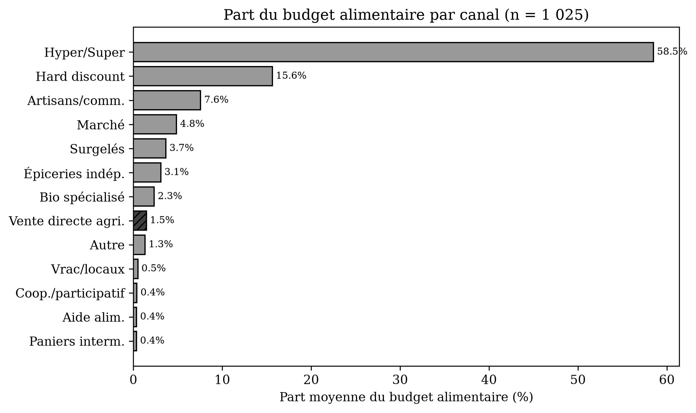
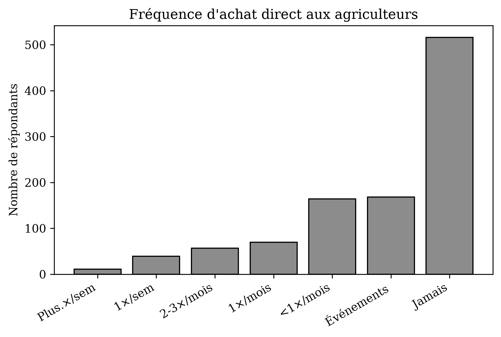
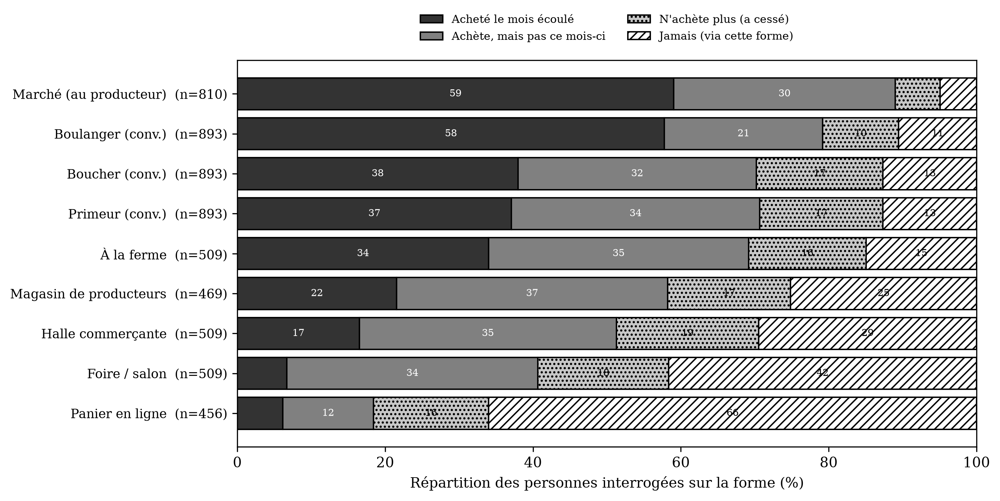
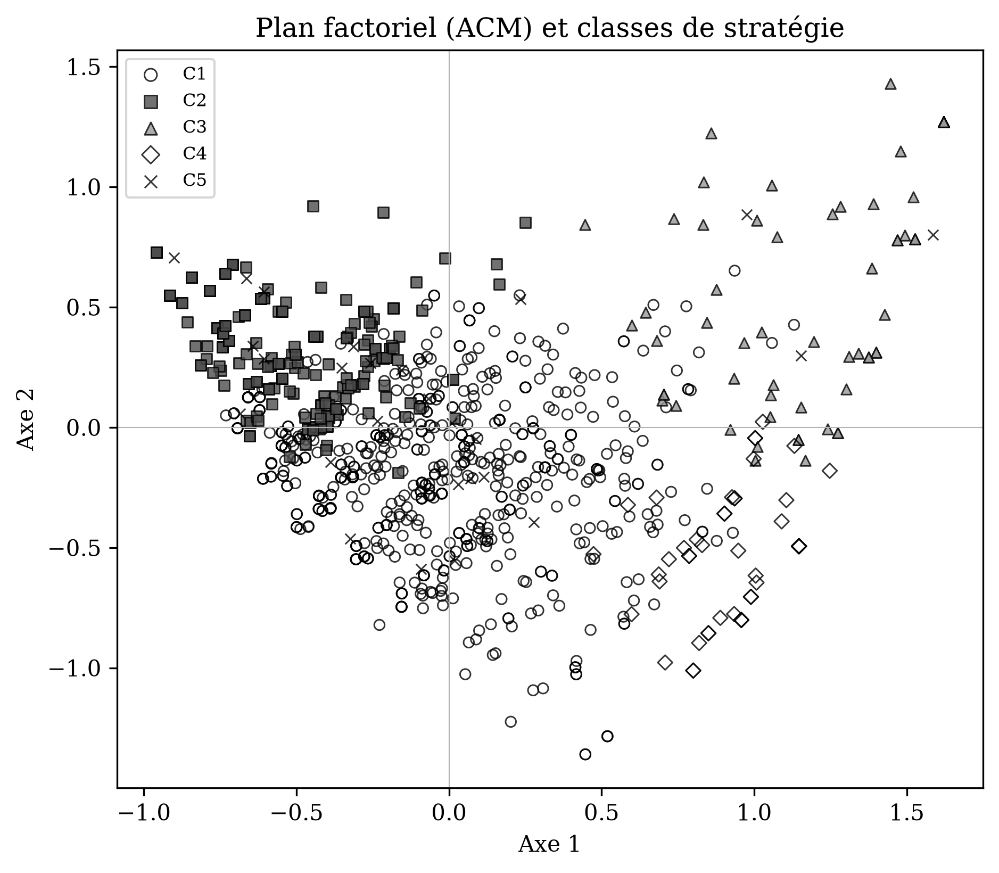
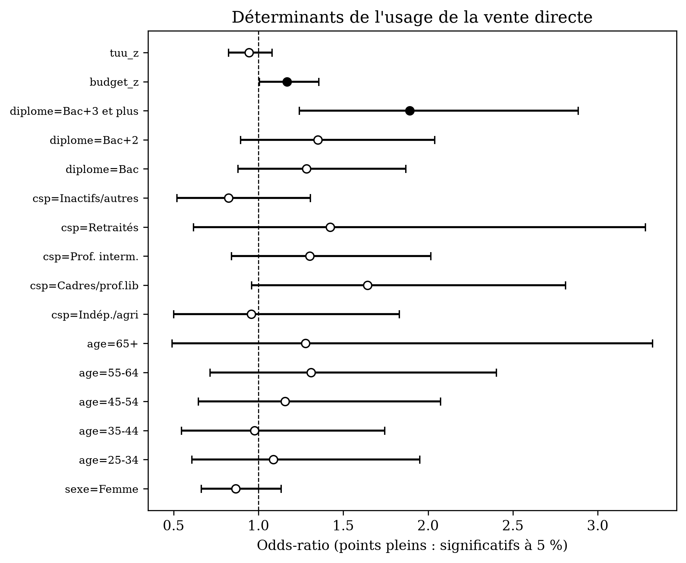
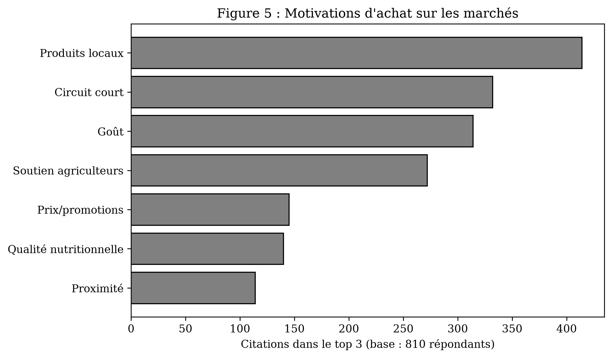

# « Beaucoup l'essaient, peu l'adoptent »
## La vente directe dans les stratégies d'approvisionnement des ménages français

*(Version anonymisée pour évaluation en double aveugle — page de titre fournie séparément.)*

---

## Résumé

**Objectifs.** Cet article analyse la place qu'occupe la vente directe (achat au producteur, à la ferme, en AMAP, en magasin de producteurs ou sur les marchés) dans le portefeuille de canaux d'approvisionnement alimentaire des ménages français, et la façon dont elle se combine avec les autres canaux.

**Méthodologie.** Une enquête par questionnaire auprès d'un échantillon représentatif national de 1 025 ménages mesure, pour treize canaux d'achat, la fréquence de recours et la part de budget. Une typologie des stratégies d'approvisionnement est construite par analyse des correspondances multiples et classification, complétée par une régression logistique des déterminants du recours à la vente directe.

**Résultats.** La vente directe présente un paradoxe : elle touche 65 % des ménages mais ne pèse que 1,5 % du budget alimentaire national (8,5 % chez ses seuls acheteurs réguliers). Elle est largement essayée mais peu retenue — 46 % des ménages qui déclarent l'utiliser n'ont rien acheté au cours du mois écoulé, et l'abandon atteint 65 % pour les AMAP. Cinq stratégies d'approvisionnement se distinguent, des « captifs de la grande distribution » aux « multi-canal intensifs ». Le recours à la vente directe est enfin faiblement déterminé par le profil sociodémographique — il traverse les catégories sociales — le seul gradient net étant le diplôme (plus que la catégorie socioprofessionnelle).

**Implications managériales.** Le levier de croissance n'est pas la conquête de nouveaux publics — déjà largement atteinte — mais la conversion de l'essai en habitude : fidélisation, régularité et diversité de l'offre, levée des freins pratiques, communication sur le local et la qualité plutôt que sur le prix.

**Originalité.** L'article importe le cadre du comportement omnicanal dans l'étude des circuits courts et segmente les ménages sur leurs pratiques d'achat déclarées (allocation de budget, fréquence, récence), et non sur leurs seules attitudes, éclairant ainsi l'écart entre intention et comportement.

**Mots-clés :** vente directe, circuits courts, approvisionnement alimentaire, comportement omnicanal, segmentation, écart intention-comportement.

## Abstract

Direct-from-farmer purchasing (on farms, in producer shops, community-supported agriculture schemes or at markets) is usually studied through its organisational forms or its buyers' motivations. Drawing on a survey of a nationally representative sample of 1,025 French households, this article instead examines the place of direct purchasing within the household's channel portfolio. Direct purchasing reaches 65 % of households but accounts for only 1.5 % of the national food budget (8.5 % among its regular buyers). Five provisioning strategies are identified, and the practice proves weakly determined by socio-demographics. The managerial challenge is therefore to turn trial into habit rather than to recruit new buyers. The paper contributes an omni-channel reading of short food supply chains and a segmentation based on actual budget allocation rather than stated attitudes.

**Keywords:** direct selling, short food supply chains, food provisioning, omni-channel behaviour, segmentation, intention-behaviour gap.

---

## Introduction

Sur un marché de plein vent, la moitié des clients disent venir chercher des « produits locaux » et un tiers « soutenir les agriculteurs » — ce sont, dans notre enquête, les deux premières motivations citées (Figure 6). Les enquêtes de consommation confirment cet engouement : les circuits courts jouissent d'une image très favorable et d'une visibilité croissante depuis le début des années 2000[^1]. Le phénomène s'est d'ailleurs installé du côté de l'offre : en 2020, près d'une exploitation agricole française sur quatre commercialisait en circuit court (Agreste, 2023). Pourtant, à l'échelle du budget des ménages, la vente directe ne pèse presque rien — une part modeste de la dépense alimentaire (Enthoven et Van den Broeck, 2021). Ce contraste entre une adhésion large et un poids économique faible est le point de départ de cet article.

L'enjeu n'est pas mince pour les acteurs. Le développement des circuits courts figure aujourd'hui parmi les objectifs affichés des politiques alimentaires territoriales, des chambres d'agriculture et d'une partie de la grande distribution, qui multiplie les rayons de producteurs. Tous partagent une même interrogation pratique : comment faire grandir une pratique qui suscite une adhésion de principe très large mais peine à se traduire dans les paniers ? Répondre suppose de savoir où, précisément, se situe le point de blocage — dans le recrutement de nouveaux acheteurs, ou dans la fidélisation de ceux qui essaient déjà.

La recherche a abondamment documenté deux faces du phénomène : les **formes d'organisation** de l'offre — vente à la ferme, marchés, AMAP, magasins de producteurs, paniers en précommande (Chiffoleau, 2019 ; Praly et al., 2014) — et les **motivations** des consommateurs — qualité, fraîcheur, confiance, soutien à l'économie locale (Dubuisson-Quellier et al., 2011 ; Birch et al., 2018). Ces travaux partagent toutefois une limite : ils étudient la vente directe **isolément**, comme un univers à part porté par une population militante, alors que, du point de vue du ménage, elle n'est presque jamais un canal exclusif. Elle s'insère dans une combinaison de lieux d'achat — l'hypermarché du samedi, le marché du dimanche, l'artisan de quartier — que le foyer ajuste selon les produits, les saisons, le temps et le budget.

Comprendre la place de la vente directe suppose donc de ne plus la regarder seule, mais **dans l'architecture des choix d'approvisionnement** du ménage. Nous posons la question suivante : *quelle place les achats en vente directe occupent-ils dans les stratégies d'approvisionnement alimentaire des ménages français, et selon quelles logiques se combinent-ils avec les autres canaux ?*

L'article apporte trois déplacements. Sur le plan **théorique**, il importe le cadre du **comportement omnicanal** — développé en distribution mais rarement appliqué à l'alimentation locale — pour lire la vente directe comme une fonction d'un portefeuille de canaux. Sur le plan **méthodologique**, il quitte le registre des **attitudes et intentions déclarées** (dont le consentement à payer) pour mesurer les **pratiques d'achat déclarées** — fréquence, allocation de budget, récence —, sur données représentatives. Sur le plan **managérial**, il en tire des recommandations pour les acteurs qui cherchent à développer la vente directe. Après avoir précisé ce cadre, nous présentons l'enquête, puis les résultats — le paradoxe budgétaire, une typologie en cinq stratégies, et des déterminants sociaux ténus — avant d'en discuter les implications pour l'action.

[^1]: Sources institutionnelles et professionnelles convergentes sur ce point (voir Agreste, 2023) ; voir Enthoven et Van den Broeck (2021) pour une synthèse récente de la recherche.

## L'approvisionnement alimentaire, un comportement omnicanal

### Du canal isolé au portefeuille de canaux

En France, la définition administrative des circuits courts retient la présence d'au plus un intermédiaire entre le producteur et le consommateur (Ministère de l'Agriculture et de l'Alimentation, 2009). La vente directe en est le sous-ensemble le plus strict — l'achat sans intermédiaire — et recouvre une pluralité de dispositifs : vente à la ferme, marchés où le producteur vend lui-même, magasins de producteurs, associations pour le maintien d'une agriculture paysanne (AMAP), paniers en précommande (Chiffoleau, 2019 ; Maréchal, 2008). Tous partagent une même caractéristique : la relation directe au producteur, porteuse d'un supplément de sens et d'information sur le produit (Dubuisson-Quellier et al., 2011 ; Lamine et Perrot, 2008). La revue de Enthoven et Van den Broeck (2021), qui synthétise deux décennies de recherche sur les systèmes alimentaires locaux, souligne l'hétérogénéité de ces dispositifs et, surtout, la faiblesse persistante des données représentatives sur leur diffusion réelle auprès des ménages — un déficit que la présente enquête vise à combler. La littérature sur les réseaux alimentaires alternatifs insiste par ailleurs sur la **coexistence** plutôt que la rupture entre circuits : loin de se substituer à la grande distribution, la vente directe s'y articule (Goodman et DuPuis, 2002 ; Sage, 2003) — et raccourcir la chaîne n'est pas en soi une réponse suffisante (Chiffoleau et Dourian, 2020).

La littérature en distribution a montré de longue date que les consommateurs ne sont pas fidèles à un format unique : ils **combinent plusieurs canaux** pour des fonctions distinctes, ce qui pose des enjeux spécifiques de coordination et d'allocation entre points de vente (Neslin et al., 2006). Le passage du *multicanal* à l'*omnicanal* (Verhoef et al., 2015) a ensuite déplacé l'attention de la simple juxtaposition des canaux vers leur **intégration** dans un parcours d'achat unifié, où le consommateur arbitre en continu entre points de vente selon le produit, le moment et le contexte. En France, les travaux sur le *cross-shopping* et la valeur du magasinage (Filser et Plichon, 2004 ; Volle, 2012) avaient déjà documenté cette pluralité des fréquentations : le ménage gère de fait un **portefeuille de canaux**, mobilisés pour des fonctions différentes — l'hypermarché pour le gros des courses et les prix, l'artisan pour la qualité de certains produits, le marché pour le frais et le plaisir.

Transposé aux circuits courts, ce cadre suggère que la vente directe n'entre pas en concurrence frontale avec la grande distribution : elle **occupe une fonction spécifique** dans le portefeuille — typiquement l'approvisionnement de certaines catégories (légumes, œufs, fromages, viande) valorisées pour leur fraîcheur ou leur origine. La question pertinente n'est alors plus « pourquoi acheter en vente directe ? » mais « quelle part et quelle fonction la vente directe occupe-t-elle dans le portefeuille du ménage ? ». À notre connaissance, le cadre omnicanal reste rarement appliqué de façon explicite à l'alimentation directe et locale : c'est le premier déplacement de l'article.

### De l'intention déclarée aux pratiques d'achat

La littérature sur la consommation alimentaire durable a massivement documenté les motivations d'achat en circuit court — qualité et fraîcheur perçues, confiance dans le producteur, soutien à l'économie locale, préoccupation environnementale et éthique (Dubuisson-Quellier et al., 2011 ; Birch et al., 2018). Plusieurs travaux mobilisent la théorie du comportement planifié pour relier attitudes, normes et intentions à l'achat, en insistant sur le rôle central de la confiance envers le producteur (Giampietri et al., 2016 ; Giampietri et al., 2018). Birch et al. (2018) montrent en outre que, chez le « consommateur attentif », les motivations égoïstes (goût, santé, sécurité) pèsent souvent davantage que les motivations altruistes (soutien, environnement).

Ces recherches partagent toutefois une limite bien identifiée : le fameux **écart entre attitude et comportement** (*attitude-behaviour gap*), selon lequel des attitudes très favorables ne se traduisent pas mécaniquement en achats effectifs (Vermeir et Verbeke, 2006). La revue de Feldmann et Hamm (2015), portant sur soixante-treize études, précise d'ailleurs que, contrairement au bio, l'alimentation locale n'est pas d'abord perçue comme chère : les principaux freins sont l'**inconvénience** et le **manque de disponibilité** — soit des obstacles pratiques plus que financiers. Or la plupart de ces travaux mesurent des intentions, des attitudes ou un consentement à payer hypothétique, rarement des comportements d'achat. La méta-analyse de Mustapa et Kallas (2025) montre ainsi que les consommateurs se déclarent prêts à payer une prime substantielle pour un produit de circuit court — une disposition dont rien ne garantit qu'elle se traduise dans les volumes achetés. Le deuxième déplacement de l'article consiste précisément à quitter le registre des attitudes et des intentions pour mesurer les **pratiques d'achat déclarées** — fréquence de recours, allocation de budget, récence : combien, concrètement, le ménage déclare-t-il consacrer à la vente directe, et non combien il dit vouloir y consacrer. Nos données restent déclaratives, mais elles portent sur des comportements effectifs et non sur des dispositions.

### Segmenter par les pratiques plutôt que par les attitudes

Un troisième courant cherche à **segmenter** les consommateurs de produits locaux ou de circuits courts. Les revues récentes montrent que cette segmentation s'appuie le plus souvent sur des attitudes, des motivations ou des variables sociodémographiques (Feldmann et Hamm, 2015). La revue systématique de Herzig et Zander (2025) conclut cependant que ces variables sociodémographiques, bien que fréquemment étudiées, expliquent finalement peu le comportement, au profit de facteurs contextuels, informationnels et relationnels ; la méta-analyse de Mustapa et Kallas (2025) relève de son côté des effets hétérogènes du genre, de l'âge, de l'éducation et de la région sur le consentement à payer. Ces approches segmentent donc les individus par leurs **dispositions** déclarées. Nous proposons une segmentation d'une autre nature, fondée non sur des attitudes mais sur le **portefeuille de canaux effectivement mobilisé** et l'allocation de budget déclarée qui en résulte : elle classe les ménages selon *ce qu'ils font* — la combinaison et l'intensité de fréquentation de treize canaux — plutôt que selon *ce qu'ils déclarent penser*. C'est le troisième déplacement de l'article.

Ce positionnement (Tableau 1) conduit à trois attentes, que l'analyse met à l'épreuve. D'abord, la vente directe occuperait rarement la place de canal principal : diffusion potentiellement large, mais part de budget faible (complémentarité, non substitution). Ensuite, sa pratique serait faiblement déterminée par le profil sociodémographique : elle traverserait les catégories. Enfin, conformément à l'écart attitude-comportement, l'adhésion déclarée serait nettement plus forte que le poids budgétaire effectif — beaucoup l'essaieraient, peu l'adopteraient.

**Tableau 1 : Positionnement de l'article**

| Courant mobilisé | Références principales | Déplacement proposé |
|------------------|------------------------|----------------------|
| Comportement omnicanal | Neslin et al. (2006) ; Verhoef et al. (2015) | Application inédite à l'alimentation locale et directe |
| Consommation durable | Vermeir et Verbeke (2006) ; Giampietri et al. (2016, 2018) ; Birch et al. (2018) | Des attitudes/intentions aux pratiques d'achat déclarées |
| Segmentation | Feldmann et Hamm (2015) ; Herzig et Zander (2025) ; Mustapa et Kallas (2025) | Segmentation par le portefeuille de canaux et le budget réel |
| Circuits courts (UE/France) | Enthoven et Van den Broeck (2021) ; Chiffoleau (2019) ; Agreste (2023) | Mesure représentative nationale, côté ménage |

## Une enquête représentative sur treize canaux d'achat

L'étude repose sur une enquête par questionnaire auprès d'un échantillon représentatif national de 1 025 ménages responsables, au moins partiellement, de leurs achats alimentaires (Encadré 1). Pour chacun des treize canaux, le répondant a indiqué sa fréquence de recours (échelle en sept positions, de « plusieurs fois par semaine » à « jamais ») et la part de son budget alimentaire mensuel qui y est consacrée. Nous distinguons la **pénétration** (le ménage fréquente le canal) de l'**usage régulier** (au moins une fois par mois). La vente directe est repérée par une double porte : acheter directement aux agriculteurs hors marchés, ou acheter sur les marchés directement auprès d'un producteur.

Deux précisions de mesure importent pour la lecture des résultats. D'abord, les parts de budget somment à 100 % par ménage : elles forment une décomposition complète, et la part moyenne d'un canal sur l'ensemble des ménages s'interprète comme son **poids économique** dans la population. Ensuite, cette question de budget n'a été posée qu'aux ménages fréquentant le canal au moins mensuellement ; les autres sont traités comme y consacrant une part nulle. Les parts rapportées constituent donc un **plancher**, que nous distinguons systématiquement de la part moyenne mesurée **parmi les seuls acheteurs réguliers** (intensité de la pratique). La typologie des stratégies d'approvisionnement est construite en deux temps (Encadré 2).

------------------------------------------------------------

**Encadré 1 : Le dispositif d'enquête**

Enquête par questionnaire administrée à un échantillon représentatif national de **1 025 ménages** français, construit par quotas (sexe, âge, catégorie socioprofessionnelle, région, taille d'agglomération) ; terrain de **septembre**. L'échantillon compte 52,6 % de femmes ; les 65 ans et plus représentent 26,0 %, les employés et ouvriers 30,0 %, les retraités 28,1 %. Le budget alimentaire mensuel médian déclaré est de 400 € (moyenne 436 €). La qualité des données est élevée : aucune valeur manquante sur les variables clés, et les parts de budget somment exactement à 100 % pour tous les répondants. Les treize canaux couvrent l'ensemble de l'offre : grande distribution et hard discount, épiceries, surgelés, magasins bio, marchés, achat direct aux agriculteurs, paniers en ligne, artisans, coopératives, vrac, aide alimentaire. Les questions de récence portent explicitement sur le mois de septembre, mois de pleine saison pour les marchés et les produits locaux — ce qui, le cas échéant, tend à *sur*-estimer l'activité récente des formes directes plutôt qu'à la minorer.

------------------------------------------------------------

------------------------------------------------------------

**Encadré 2 : Construire une typologie de stratégies d'approvisionnement**

Comment regrouper les ménages selon leur façon de combiner les canaux ? Nous procédons en deux temps. Une **analyse des correspondances multiples** (ACM) résume la fréquence de recours aux onze canaux de consommation courante (recodée en trois niveaux : régulier, occasionnel, jamais) en cinq dimensions synthétiques (dont les deux premières concentrent 62 % de l'inertie). Une **classification ascendante hiérarchique** (méthode de Ward) regroupe ensuite les ménages proches sur ces dimensions. Le nombre de classes a été arrêté par examen conjoint de la qualité de partition et de l'interprétabilité : la solution à cinq classes maximise la silhouette moyenne (0,24, contre 0,21 à quatre classes et 0,23 à six) et la découpe à six ne fait que scinder le plus gros groupe sans gain. Cette silhouette **modérée**, caractéristique d'une segmentation sur variables d'usage, invite à lire la typologie comme un ensemble de configurations dominantes plutôt que de frontières nettes. Les effectifs (voir Tableau 5) confirment une classe majoritaire et des classes de queue de distribution — la plus petite (n = 26) n'est interprétée qu'avec prudence. La typologie décrit ainsi des **configurations d'usage réelles**, et non des groupes définis a priori.

------------------------------------------------------------

## La vente directe : répandue mais marginale

Les ménages français mobilisent en moyenne **6,8 canaux** d'approvisionnement différents : la pluralité des fréquentations, postulée par le cadre omnicanal, est ici pleinement confirmée. La hiérarchie est nette (Figure 1, Tableau 2) : l'hypermarché-supermarché domine sans partage (99,1 % de pénétration, 58,5 % du budget), suivi du hard discount (15,6 % du budget), des artisans et commerçants spécialisés (7,6 %) et du marché (4,8 %). Les canaux de circuits courts proprement dits ne pèsent qu'à la marge dans le budget. L'ensemble dessine une structure en **noyau et périphérie** : un noyau — grande distribution et discount — qui concentre près des trois quarts du budget, et une périphérie de canaux spécialisés, dont la vente directe, fréquentés par beaucoup mais pour de faibles montants. C'est dans cette périphérie, et non en rivalité avec le noyau, que se joue la vente directe.

**Figure 1 : Part du budget alimentaire par canal (n = 1 025)**

En appliquant la définition à double porte, **65,0 % des ménages** (IC à 95 % : 62,0–67,8 ; n = 666 sur 1 025) pratiquent une forme de vente directe. L'achat direct aux agriculteurs (hors marchés) concerne 49,7 % des ménages (n = 509), mais seulement 17,3 % de façon régulière (n = 177 ; Figure 2) ; l'achat direct au producteur sur les marchés ajoute 157 ménages — un quart de la population concernée — qui n'auraient pas été comptés autrement. Reconnaître cette seconde porte importe : réduire la vente directe à ses formes les plus institutionnalisées (AMAP, magasins de producteurs) en sous-estimerait nettement la diffusion, en ignorant le marché, premier lieu de contact direct avec les agriculteurs.

**Tableau 2 : Pénétration et part de budget des principaux canaux (n = 1 025)**

| Canal | Pénétration | Réguliers (≥ 1×/mois) | Part de budget |
|-------|-------------|-----------------------|----------------|
| Hypermarché / supermarché | 99,1 % | 97,5 % | 58,5 % |
| Hard discount | 86,5 % | 64,2 % | 15,6 % |
| Artisans / commerçants spécialisés | 87,1 % | 61,9 % | 7,6 % |
| Marché | 78,8 % | 41,4 % | 4,8 % |
| Magasins bio spécialisés | 57,4 % | 24,2 % | 2,3 % |
| Vente directe aux agriculteurs | 49,7 % | 17,3 % | 1,5 % |
| Paniers via intermédiaire | 15,7 % | 5,8 % | 0,4 % |

**Figure 2 : Fréquence d'achat direct aux agriculteurs**

Ce poids budgétaire se lit à deux échelles. Rapportée à l'ensemble des ménages, la vente directe aux agriculteurs ne représente que **1,5 % du budget** alimentaire — environ 7 € par mois pour le ménage moyen : c'est son poids économique dans la population, comparable à celui des autres canaux. Mais rapportée à ses seuls acheteurs réguliers, elle en pèse **8,5 %** (près de 42 € par mois) : chez ses adeptes, elle n'a rien d'anecdotique. Un canal marginal à l'échelle du pays, mais ancré dans le budget d'une minorité active.

Le contraste que nous relevons pourrait n'être qu'un effet des définitions retenues — 65 % étant la mesure la plus large et 1,5 % la plus conservatrice. Le Tableau 3 le met à l'épreuve en croisant les trois définitions possibles de la vente directe avec les deux dénominateurs budgétaires. Le paradoxe y résiste : même sous la définition la plus stricte (usage régulier, 17,3 % des ménages), la part de budget chez ces seuls réguliers (8,5 %) reste minoritaire ; et la diffusion large (65 %) coexiste avec un poids national de 1,5 % quelle que soit la porte d'entrée. L'écart entre adhésion et poids n'est donc pas un artefact du choix de dénominateur.

**Tableau 3 : Sensibilité — définition de la vente directe et dénominateur budgétaire**

| Définition retenue | n | % ménages | Part du budget /population | Part du budget /acheteurs réguliers |
|--------------------|:---:|:---:|:---:|:---:|
| Inclusive — union des deux portes | 666 | 65,0 % | — | — |
| Pénétration (achat direct, toute fréquence) | 509 | 49,7 % | 1,5 % | — |
| Régulière (au moins mensuelle) | 177 | 17,3 % | 1,5 % | 8,5 % |

*Le poids budgétaire est mesuré sur la part propre de l'achat direct aux agriculteurs (canal identifiable). « /population » rapporte à l'ensemble des 1 025 ménages (plancher, part nulle imputée aux non-réguliers) ; « /acheteurs réguliers » à la seule sous-population qui y recourt au moins une fois par mois (intensité).*

Le contraste entre cette diffusion large (deux ménages sur trois) et ce faible poids économique constitue le résultat central. La vente directe n'est pas, pour l'immense majorité des ménages, un canal de substitution à la grande distribution, mais un **complément ciblé**, mobilisé occasionnellement. C'est une manifestation nette de l'écart entre les dispositions déclarées et les comportements d'achat : l'adhésion de principe est massive, la part de budget marginale. La vente directe est, en somme, largement essayée mais rarement intensive.

## De l'essai à l'adoption : une pratique peu retenue

Le faible poids budgétaire trouve un écho dans un second indicateur, indépendant : la **récence d'achat**. Au-delà de la question générale de fréquentation, l'enquête demande, pour chaque forme de vente directe, si le ménage y a acheté au cours du mois écoulé, en distinguant quatre situations : un **achat récent** (le mois écoulé), un **achat plus ancien mais toujours pratiqué**, un **achat abandonné** (« j'en achetais, mais ce n'est plus le cas ») et l'**absence d'achat** par cette forme. Pour situer ces formes, nous les comparons à trois circuits conventionnels spécialisés — le boulanger, le boucher, le primeur — soumis aux mêmes questions (Tableau 4, Figure 3). Ces comparateurs portent sur une population distincte (les 893 clients d'artisans, contre 509 acheteurs directs) : la mise en regard éclaire l'ordre de grandeur des situations, sans prétendre à une équivalence stricte entre populations.

Au niveau agrégé, parmi les 509 ménages qui déclarent acheter en vente directe aux agriculteurs, **54 % seulement ont effectivement acheté au cours du mois écoulé** via l'une des formes ; 46 % n'ont rien acheté ce mois-là. Une part de ces 46 % relève d'une **intermittence** attendue — le terrain de septembre, mois de saison, joue plutôt en faveur des formes directes — et non d'un décrochage : l'**abandon déclaré** (« j'en achetais, ce n'est plus le cas ») reste modéré, de 15 à 19 % selon les formes (Tableau 4). C'est donc surtout la régularité, non la fidélité définitive, que la fréquentation déclarée surestime : beaucoup achètent par intermittence plutôt qu'ils n'ont cessé.

Surtout, la récence décroît fortement avec l'effort qu'exige la forme, et la comparaison conventionnelle le souligne. Les canaux du quotidien sont fortement ancrés : chez le boulanger, 58 % des clients ont acheté le mois écoulé ; sur le marché au producteur, 59 %. Mais dès que la forme demande une démarche spécifique, la récence s'effondre : 20 % pour les magasins de producteurs, 17 % pour les halles, 7 % pour les foires et salons, 6 % pour les paniers en ligne. Le boucher et le primeur (37-38 %) se situent au niveau de l'achat à la ferme (34 %), signe que le clivage ne suit pas la frontière conventionnel/alternatif mais bien le **degré d'effort** requis. Deux mécanismes se conjuguent. D'abord un déficit de **notoriété** des formes les plus institutionnelles : parmi les acheteurs directs eux-mêmes, 8 % ignorent ce qu'est un magasin de producteurs, 10 % ce qu'est un panier en ligne de type La Ruche, et jusqu'à **46 % ce qu'est une AMAP**. Ensuite un abandon marqué là où l'engagement est le plus fort : parmi les 116 ménages qui ont un jour été clients d'une AMAP (41 le sont encore, 75 ne le sont plus), près des deux tiers (**65 %**, IC à 95 % : 56–73) ont cessé — chiffre frappant, mais assis sur un effectif modeste, à manier avec prudence.

**Tableau 4 : Récence d'achat par forme de vente directe et comparaison conventionnelle**

| Forme | Interrogés (n) | Acheté le mois écoulé | Achète, pas ce mois-ci | N'achète plus | Jamais / ne connaît pas |
|-------|:---:|:---:|:---:|:---:|:---:|
| Marché (au producteur) | 810 | 59 % | 30 % | 6 % | 5 % |
| Boulanger *(conv.)* | 893 | 58 % | 21 % | 10 % | 11 % |
| Boucher *(conv.)* | 893 | 38 % | 32 % | 17 % | 13 % |
| Primeur *(conv.)* | 893 | 37 % | 34 % | 17 % | 13 % |
| À la ferme | 509 | 34 % | 35 % | 16 % | 15 % |
| Magasin de producteurs | 509 | 20 % | 34 % | 15 % | 31 % |
| Halle commerçante | 509 | 17 % | 35 % | 19 % | 29 % |
| Foire / salon | 509 | 7 % | 34 % | 18 % | 42 % |
| Panier en ligne (La Ruche…) | 509 | 6 % | 11 % | 14 % | 70 % |

*Base : personnes interrogées sur chaque forme, en % ligne. Les 509 ménages qui achètent en vente directe aux agriculteurs sont interrogés sur toutes les formes directes ; la dernière colonne réunit « jamais acheté » et, pour les formes les moins connues, « ne connaît pas cette forme » (8 % pour les magasins de producteurs, 10 % pour les paniers en ligne). Les circuits en italique (boulanger, boucher, primeur) sont des comparateurs conventionnels spécialisés (clients d'artisans, n = 893). L'AMAP est traitée à part (questionnaire sans référence au mois écoulé) : parmi ses clients passés ou présents, 35 % le sont encore, 65 % ont cessé.*

**Figure 3 : Récence d'achat par forme (vente directe et circuits conventionnels spécialisés)**

Ce gradient confirme, par un tout autre chemin que le budget, le même diagnostic : la vente directe est **largement essayée, mais son usage peine à s'ancrer** — et d'autant plus que la forme exige de l'engagement. Le point de fuite n'est donc pas l'accès ou l'essai, déjà acquis, mais la **rétention**.

## Cinq stratégies d'approvisionnement

La typologie fait émerger cinq stratégies distinctes (Figure 4, Tableau 5), que l'examen conjoint de la pénétration et de l'usage régulier permet de caractériser. La lecture des deux mesures de vente directe — inclusive (au moins un achat) et régulière (au moins mensuel) — est essentielle, car un taux inclusif élevé peut recouvrir un simple essai.

**Figure 4 : Plan factoriel (ACM) et classes de stratégie**

**Tableau 5 : Les cinq stratégies d'approvisionnement**

| Stratégie | Part (n) | Canaux (fréq. / rég.) | Budget moyen | Vente directe | dont régulière | Signature |
|-----------|:---:|:---:|--------------|---------------|----------------|-----------|
| Multi-canal modérés | 61 % (624) | 7,2 / 3,8 | 439 € | 72 % | 16 % | Hypermarché + quelques compléments |
| Captifs de la grande distribution | 24 % (249) | 3,8 / 2,8 | 408 € | 28 % | 6 % | Hypermarché + discount, peu d'alternatives |
| Multi-canal intensifs | 8 % (79) | 11,1 / 9,5 | 513 € | 97 % | 67 % | Tous les canaux, y compris niche, régulièrement |
| Explorateurs conventionnels | 5 % (47) | 11,0 / 6,1 | 480 € | 100 % | 19 % | Essaient tout, cœur régulier conventionnel |
| Adeptes de la proximité | 2,5 % (26) | 6,3 / 3,3 | 320 € | 81 % | 8 % | Seul groupe sans hypermarché régulier |

*« Canaux (fréq. / rég.) » : nombre moyen de canaux fréquentés / utilisés régulièrement (sur 13). Effectifs bruts entre parenthèses ; la classe « adeptes de la proximité » (n = 26) est de faible effectif, ses caractéristiques fines sont indicatives.*

Les **multi-canal modérés** (61 % de l'échantillon) articulent l'hypermarché à quelques compléments et recourent modérément à la vente directe. Les **captifs de la grande distribution** (24 %) concentrent leurs achats sur l'hypermarché et le discount et se tiennent le plus à l'écart des alternatives. À l'opposé, les **multi-canal intensifs** (8 %) mobilisent presque tous les canaux régulièrement, avec le budget le plus élevé : ce sont les seuls acheteurs vraiment intensifs en vente directe (67 % au moins mensuellement). Le cas des **explorateurs conventionnels** (5 %) est instructif : ils affichent 100 % de vente directe au sens inclusif, mais ce chiffre traduit un large répertoire d'essai — ils ont goûté à presque tous les canaux sans les intégrer à leurs habitudes, leur vente directe régulière retombant à 19 %. Enfin, les ménages **adeptes de la proximité** (2,5 %), les seuls à ne pas recourir régulièrement à la grande distribution, s'appuient sur le marché et la proximité, avec le budget le plus modeste : ce profil, marginal en effectif, montre qu'un approvisionnement structurellement périphérique à la grande distribution existe, et qu'il n'est pas le fait des ménages les plus aisés.

Deux enseignements transversaux ressortent de cette typologie. Le premier est que la distinction entre **essai** et **usage adopté** — qu'illustre l'écart entre vente directe inclusive et régulière — structure l'ensemble : le taux inclusif de vente directe croît avec l'ampleur du répertoire de canaux (de 28 % chez les captifs à 100 % chez les explorateurs conventionnels), mais l'usage régulier ne culmine que chez les multi-canal intensifs (67 %), montrant que largeur du répertoire et intensité d'engagement ne se confondent pas. Le second est que ce n'est pas le profil social qui prédit le mieux la vente directe, mais la **configuration d'usage** — la stratégie d'approvisionnement — dans laquelle elle s'inscrit : les multi-canal intensifs l'ancrent dans une routine multi-canal dense, les captifs s'en tiennent à distance, les explorateurs conventionnels l'essaient sans la pérenniser. Cette grille de segmentation par les pratiques est directement actionnable, car chaque configuration appelle un levier différent.

## Qui achète en direct ? Des déterminants sociaux ténus

Les cinq stratégies diffèrent significativement par la catégorie socioprofessionnelle (p < 0,001), par le **diplôme** (p < 0,001) et par l'âge (p = 0,005). Les multi-canal intensifs et les explorateurs conventionnels sont nettement les plus diplômés — 42 à 43 % de bac+3 ou plus, contre seulement 4 à 11 % de non-bacheliers — et disposent des budgets les plus élevés ; les captifs de la grande distribution sont à l'inverse les moins diplômés (un tiers sans le bac) ; les multi-canal modérés reflètent la structure moyenne ; le groupe adeptes de la proximité se distingue par sa part élevée de retraités et son budget réduit. Ces écarts, réels, restent toutefois modestes au regard de la dispersion interne des classes.

La régression logistique du recours à la vente directe (Figure 5 ; N = 1 025, 666 pratiquants) le confirme : même en intégrant le diplôme, le modèle explique très peu de sa variance (pseudo-R² de McFadden = 0,029). Le déterminant le plus net est le **niveau de diplôme** : détenir un diplôme de niveau bac+3 ou plus multiplie par 1,89 les chances de pratiquer la vente directe (p = 0,003). Un budget alimentaire élevé joue également, modérément (odds-ratio = 1,17 par écart-type, p = 0,042). Fait notable, une fois le diplôme pris en compte, l'effet de la catégorie « cadres » s'estompe (odds-ratio = 1,64, p = 0,07, non significatif) — les deux variables étant modérément liées (V de Cramér diplôme × CSP = 0,29), tandis que le diplôme n'est pas un simple relais du revenu (corrélation diplôme × budget = 0,06). C'est donc l'**éducation**, plus que la position socioprofessionnelle, qui constitue le principal gradient social. Le sexe, l'âge et la taille d'agglomération restent sans effet significatif.

Ce gradient éducatif mérite toutefois une précision qui en dit long : il porte sur le fait d'**avoir essayé** la vente directe (définition inclusive), non sur son adoption régulière. Refaite sur la définition stricte — l'achat direct au moins mensuel —, la même régression voit l'effet du diplôme s'évanouir (odds-ratio du bac+3 ramené à 1,22, p = 0,45 ; pseudo-R² = 0,016). Autrement dit, les plus diplômés franchissent un peu plus souvent le pas de l'essai, mais ne sont pas plus enclins que les autres à en faire une habitude. Le profil social prédit marginalement qui goûte à la vente directe ; il ne prédit quasiment pas qui l'adopte — ce qui renvoie, une fois de plus, à la configuration d'usage plutôt qu'à la position sociale.

**Figure 5 : Déterminants de l'usage de la vente directe (odds-ratios)**

La faiblesse de ce pouvoir explicatif est en soi un résultat : la vente directe n'est pas le marqueur d'un groupe social circonscrit. Si les plus diplômés y recourent un peu plus, l'essentiel de la pratique se distribue transversalement — comme l'illustre l'existence du groupe adeptes de la proximité, plus âgé et à budget modeste. Ce constat converge avec Herzig et Zander (2025), pour qui les variables sociodémographiques expliquent finalement peu le comportement d'achat en circuit court.

Interrogés sur leurs raisons d'acheter sur les marchés — lieu de contact direct le plus fréquent avec les producteurs —, les répondants placent en tête les produits locaux (cités dans le top 3 par 51 % d'entre eux), le circuit court (41 %), le goût (39 %) et le soutien aux agriculteurs (34 %) ; le prix n'arrive qu'au cinquième rang (18 %) (Figure 6). La vente directe se joue sur le registre de la qualité et du sens, non sur celui de l'économie monétaire.

**Figure 6 : Motivations d'achat sur les marchés**

## Ce que les acteurs peuvent en faire

Ces résultats déplacent le diagnostic habituel. Tant que la vente directe est pensée comme une pratique de niche à diffuser, l'effort porte naturellement sur la sensibilisation et la conquête de nouveaux convaincus. Or nos données montrent que la conquête est, pour l'essentiel, déjà faite : deux ménages sur trois ont franchi le pas de l'achat direct. Le problème n'est pas d'ouvrir le canal à de nouveaux publics, mais de le **rendre régulier** chez ceux qui l'ont déjà essayé. Cette bascule de diagnostic — de l'acquisition vers la fidélisation, du convaincre vers le faciliter — structure quatre recommandations (Encadré 3), adressées prioritairement aux producteurs et réseaux de vente directe et aux collectivités.

**Miser sur la fidélisation, non sur l'acquisition.** Le potentiel de conquête est largement atteint : 65 % des ménages ont déjà acheté en direct, mais seuls 17 % le font régulièrement, et un seul groupe sur cinq — les multi-canal intensifs — a vraiment adopté la pratique. Le gisement de croissance se situe donc chez les quelque 48 % de ménages qui achètent en direct **sans régularité** : les faire passer de l'essai à l'habitude produirait un effet budgétaire bien supérieur à celui du recrutement de nouveaux essayeurs. Un ordre de grandeur le montre : les 17 % de réguliers actuels portent une part nationale de 1,5 % à une intensité de 8,5 % de leur budget ; si les essayeurs irréguliers atteignaient cette même régularité, la part nationale de la vente directe passerait mécaniquement à environ **4 %** — un quasi-triplement, hors de portée du seul recrutement, la pénétration étant déjà proche de son plafond. Cette projection est une borne haute (elle suppose que les convertis achètent aussi intensément que les réguliers d'aujourd'hui) ; elle vaut comme ordre de grandeur, non comme prévision. Le fort taux d'abandon des formes les plus engageantes — jusqu'à 65 % pour les AMAP — confirme que l'enjeu est bien la **rétention**, non l'acquisition. Pour les producteurs et les réseaux de vente directe, cela oriente l'effort vers les **dispositifs de régularité** : abonnements et paniers récurrents à engagement souple, points de retrait situés sur les trajets domicile-travail plutôt qu'au seul lieu de production, élargissement des gammes pour couvrir une plus grande part du panier (et non les seuls fruits et légumes), horaires compatibles avec les actifs, et animation de la relation client (rappels, préparation anticipée des commandes, information sur la saisonnalité). La lecture omnicanale invite à ne pas opposer physique et numérique : la précommande en ligne assortie d'un retrait physique combine la commodité attendue et le contact direct valorisé.

**Lever les freins pratiques, pas les réticences.** Les motivations sont acquises — local, qualité, goût, soutien aux agriculteurs arrivent loin devant le prix — et les freins ne sont pas idéologiques mais logistiques : temps, accessibilité, régularité et diversité de l'offre (Feldmann et Hamm, 2015). Pour les pouvoirs publics et les collectivités — notamment dans le cadre des projets alimentaires territoriaux —, l'action utile porte donc moins sur la sensibilisation, largement redondante, que sur l'**infrastructure** de la vente directe : mutualisation de points de vente et de logistique (halles de producteurs, drives fermiers partagés), horaires élargis, présence dans les zones périurbaines et rurales mal desservies, articulation avec la restauration collective pour sécuriser des débouchés réguliers aux producteurs. Autrement dit, financer des équipements et des services plutôt que des campagnes de conviction.

**Cibler large, pas une niche.** La vente directe restant faiblement déterminée socialement — le modèle n'explique que 3 % de la variance de la pratique, avec pour seul gradient net un léger sur-recours des plus diplômés, et encore à l'essai seulement, pas à l'adoption régulière —, il n'y a pas lieu de la réserver, dans les représentations comme dans le ciblage marketing, à un segment aisé et urbain. Les dispositifs peuvent viser tous les publics, y compris les budgets modestes : le profil adeptes de la proximité, plus âgé et moins doté, montre qu'un approvisionnement de proximité à petit budget est non seulement possible mais déjà pratiqué. Ce constat plaide contre une segmentation par le revenu ou la CSP, et pour une segmentation par la **stratégie d'approvisionnement** : c'est la configuration d'usage (multi-canal modérés, captifs, intensifs…), et non la position sociale, qui prédit le recours à la vente directe et indique le levier pertinent. Que le seul gradient social net passe par le **diplôme** plutôt que par le revenu ou la catégorie socioprofessionnelle est d'ailleurs riche d'enseignement : il oriente vers un frein **informationnel et culturel** — savoir où trouver ces circuits, en comprendre le fonctionnement — davantage que financier. Le déficit de notoriété relevé plus haut, où près d'un acheteur direct sur deux ignore ce qu'est une AMAP, va dans le même sens. Le levier n'est donc pas de rendre la vente directe moins chère, mais plus **lisible et accessible** pour des publics aujourd'hui tenus à distance moins par le pouvoir d'achat que par l'information.

**Communiquer « local et qualité », pas « pas cher ».** Le prix n'est ni le principal moteur ni le principal frein : il n'arrive qu'au cinquième rang des motivations. Chercher à concurrencer la grande distribution sur le terrain du prix serait donc une erreur de positionnement. Pour les producteurs, le registre payant est celui de l'origine, de la fraîcheur, du goût et de la relation. Pour la grande distribution elle-même, qui intègre de plus en plus de références locales, l'enjeu n'est pas de capter la vente directe mais de jouer la **complémentarité** — rayons de producteurs, traçabilité, mise en avant de l'origine —, sur un registre de sens où la vente directe a ouvert la voie. La lecture omnicanale se vérifie ici : les canaux se répartissent des fonctions plutôt qu'ils ne se cannibalisent.

Ces leviers ne s'appliquent pas uniformément : la segmentation par les stratégies d'approvisionnement indique où porter l'effort et sur qui il est vain (Tableau 6). L'effort de conversion vise en priorité les configurations qui essaient sans pérenniser — multi-canal modérés et explorateurs conventionnels —, tandis que les captifs relèvent d'un travail d'accès et de notoriété, et que les intensifs, déjà acquis, ne sont un enjeu que de maintien.

**Tableau 6 : Levier prioritaire par stratégie d'approvisionnement et par acteur**

| Stratégie (part) | Situation vis-à-vis de la vente directe | Levier prioritaire | Acteur le mieux placé |
|------------------|------------------------------------------|--------------------|------------------------|
| Multi-canal modérés (61 %) | Essaient, faible régularité | Convertir l'essai en habitude : abonnements souples, gammes élargies | Producteurs, réseaux |
| Captifs de la grande distribution (24 %) | Peu ou pas d'achat direct | Accès et notoriété : points de vente sur les trajets, information | Collectivités, réseaux |
| Multi-canal intensifs (8 %) | Déjà adoptée et régulière | Maintenir : fidélisation, diversité de l'offre | Producteurs |
| Explorateurs conventionnels (5 %) | Essaient tout, ne retiennent rien | Faire basculer vers la routine : régularité, engagement souple | Producteurs, réseaux |
| Adeptes de la proximité (2,5 %) | Approvisionnement de proximité à petit budget | Sécuriser l'offre locale accessible et abordable | Collectivités |

------------------------------------------------------------

**Encadré 3 : Quatre recommandations pour développer la vente directe**

1. **Fidéliser plutôt que recruter** — transformer l'essai en habitude (abonnements, retraits réguliers, gammes élargies). Le gisement est chez les 48 % de ménages qui achètent en direct sans régularité.
2. **Investir la logistique** — horaires, proximité, régularité de l'offre : c'est là que se joue le passage à l'usage adopté, non dans la sensibilisation.
3. **Viser tous les publics** — la pratique traverse les catégories sociales ; le seul gradient net, et sur l'essai plus que sur l'adoption, est le diplôme, signe d'un frein informationnel (notoriété, lisibilité) plus que financier.
4. **Parler local et qualité** — le prix est secondaire, dans les motivations comme dans les freins.

------------------------------------------------------------

## Limites et voies de recherche

Plusieurs limites doivent être soulignées. L'enquête est **transversale** : elle décrit un état, non une trajectoire, et ne permet pas de mesurer les effets récents de la crise sanitaire ou de l'inflation alimentaire, que la littérature documente par ailleurs. Les mesures sont **déclaratives** : les fréquences et surtout les parts de budget reposent sur l'estimation des répondants, sujette à des biais de mémoire et de désirabilité sociale — la sur-déclaration probable des comportements valorisés socialement renforce d'ailleurs le contraste que nous relevons avec le faible poids budgétaire effectif. La part directe des achats réalisés sur les marchés n'étant pas isolable du budget « marché », le poids budgétaire total de la vente directe est en outre légèrement sous-estimé. À l'inverse, la « seconde porte » — l'achat déclaré directement à un producteur sur le marché — repose sur une auto-déclaration dont la fiabilité est incertaine, une partie des vendeurs de marché étant en réalité des revendeurs : la pénétration inclusive de 65 % constitue à ce titre une borne haute, et c'est pourquoi nous distinguons systématiquement cette mesure de la pénétration régulière (17 %) et du poids budgétaire (1,5 %). Enfin, la plus petite classe (adeptes de la proximité, n = 26) appelle la prudence dans l'interprétation de ses caractéristiques fines, la partition d'ensemble présentant une silhouette modérée (0,24) ; et les motivations n'ont été analysées que pour le canal des marchés.

Ces limites ouvrent des pistes. Un suivi **longitudinal** permettrait de tester si la place d'appoint de la vente directe se consolide ou se recompose sous l'effet des tensions sur le pouvoir d'achat. La grille des stratégies d'approvisionnement pourrait être réinvestie pour d'autres canaux alternatifs (bio, vrac, anti-gaspillage). Surtout, la distinction entre **essai** et **usage adopté** — que révèle l'écart entre vente directe inclusive et régulière — mériterait d'être approfondie : comprendre ce qui fait basculer un ménage de l'un à l'autre est sans doute la question la plus utile pour qui veut faire passer la vente directe du répertoire d'appoint au socle de l'approvisionnement.

## Références

Agreste (2023), Près d'une exploitation sur quatre vend en circuit court, *Agreste Primeur*, n°2023-5 (Recensement agricole 2020), Ministère de l'Agriculture.

Birch D., Memery J. et De Silva Kanakaratne M. (2018), The mindful consumer: balancing egoistic and altruistic motivations to purchase local food, *Journal of Retailing and Consumer Services*, 40: 221-228.

Chiffoleau Y. (2019), *Les circuits courts alimentaires : entre marché et innovation sociale*, Toulouse, Érès.

Chiffoleau Y. et Dourian T. (2020), Sustainable food supply chains: is shortening the answer? A literature review for a research and innovation agenda, *Sustainability*, 12(23): 9831.

Dubuisson-Quellier S., Lamine C. et Le Velly R. (2011), Citizenship and consumption: mobilisation in alternative food systems in France, *Sociologia Ruralis*, 51(3): 304-323.

Enthoven L. et Van den Broeck G. (2021), Local food systems: reviewing two decades of research, *Agricultural Systems*, 193: 103226.

Feldmann C. et Hamm U. (2015), Consumers' perceptions and preferences for local food: a review, *Food Quality and Preference*, 40: 152-164.

Filser M. et Plichon V. (2004), La valeur du comportement de magasinage : statut théorique et apports au positionnement de l'enseigne, *Revue Française de Gestion*, 30(148): 29-43.

Giampietri E., Finco A. et Del Giudice T. (2016), Exploring consumers' behaviour towards short food supply chains, *British Food Journal*, 118(3): 618-631.

Giampietri E., Verneau F., Del Giudice T. et al. (2018), A theory of planned behaviour perspective for investigating the role of trust in consumer purchasing decision related to short food supply chains, *Food Quality and Preference*, 64: 160-166.

Goodman D. et DuPuis E.M. (2002), Knowing food and growing food: beyond the production-consumption debate in the sociology of agriculture, *Sociologia Ruralis*, 42(1): 5-22.

Herzig J. et Zander K. (2025), Determinants of consumer behavior in short food supply chains: a systematic literature review, *Agricultural and Food Economics*, 13(1): 1-40.

Lamine C. et Perrot N. (2008), *Les AMAP : un nouveau pacte entre producteurs et consommateurs ?*, Gap, Yves Michel.

Maréchal G. (coord.) (2008), *Les circuits courts alimentaires : bien manger dans les territoires*, Dijon, Educagri.

Ministère de l'Agriculture et de l'Alimentation (2009), *Plan d'action pour développer les circuits courts*, avril.

Mustapa M.A.A. et Kallas Z. (2025), Meta-analysis of consumer willingness to pay for short food supply chain products, *Global Challenges*, 9(3).

Neslin S.A., Grewal D., Leghorn R. et al. (2006), Challenges and opportunities in multichannel customer management, *Journal of Service Research*, 9(2): 95-112.

Praly C., Chazoule C., Delfosse C. et al. (2014), Les circuits de proximité, cadre d'analyse de la relocalisation des circuits alimentaires, *Géographie, économie, société*, 16(4): 455-478.

Sage C. (2003), Social embeddedness and relations of regard: alternative 'good food' networks in south-west Ireland, *Journal of Rural Studies*, 19(1): 47-60.

Verhoef P.C., Kannan P.K. et Inman J.J. (2015), From multi-channel retailing to omni-channel retailing, *Journal of Retailing*, 91(2): 174-181.

Vermeir I. et Verbeke W. (2006), Sustainable food consumption: exploring the consumer attitude-behavioral intention gap, *Journal of Agricultural and Environmental Ethics*, 19(2): 169-194.

Volle P. (coord.) (2012), *Stratégie clients : points de vue d'experts sur le management de la relation client*, Paris, Pearson.
